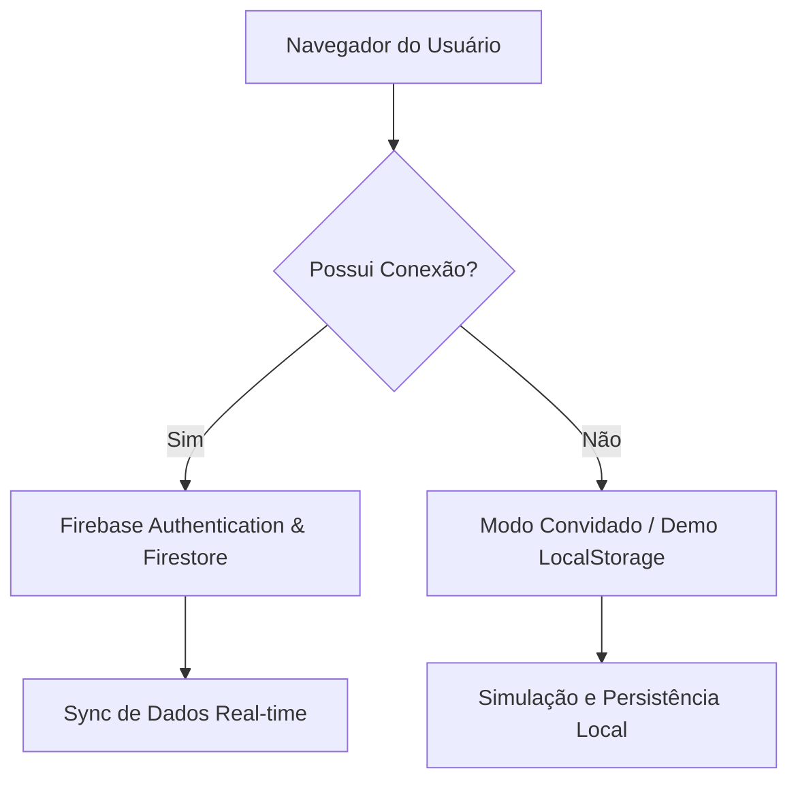

# CoreLab — Forge Your Core

> **"Forje Seu Core"** — Landing page oficial e aplicativo integrado do CoreLab: ecossistema fitness de elite com inteligência artificial, rede social integrada, banco de dados Firebase e dashboards analíticos em tempo real.

<p align="center">
  
  
  
  
  
</p>

---

## 📋 Índice

- [Sobre o Projeto](#sobre-o-projeto)
- [Funcionalidades Principais](#funcionalidades-principais)
- [Arquitetura e Integrações](#arquitetura-e-integrações)
- [Estrutura Atualizada do Projeto](#estrutura-atualizada-do-projeto)
- [Tecnologias Utilizadas](#tecnologias-utilizadas)
- [Como Executar Localmente](#como-executar-localmente)
- [Páginas do Ecossistema](#páginas-do-ecossistema)
- [Padrões de Desenvolvimento](#padrões-de-desenvolvimento)
- [Licença](#licença)

---

## Sobre o Projeto

O **CoreLab** é um aplicativo de fitness de alta performance desenvolvido como projeto acadêmico pela **UNIP Limeira** em 2026. A aplicação reúne a ciência da educação física de ponta com recursos digitais modernos, atuando como um hub para o desenvolvimento físico e mental completo do usuário.

A aplicação foi construída com tecnologias web puras (**HTML5, Vanilla CSS e Vanilla JavaScript ES6+**), combinadas com o poder do **Firebase Web SDK** para dados em tempo real e **Chart.js** para renderização gráfica, entregando uma interface premium no estilo *glassmorphic dark-theme* com velocidade ultra-rápida e zero dependências de frameworks pesados (como React, Vue ou Tailwind).

---

## Funcionalidades Principais

### 🎠 Carrossel de Destaques (Hero Carousel)
* Slide de transição e ciclo automático de 4 telas que apresentam a filosofia CoreLab.
* Efeitos de digitação dinâmica de tags e chamadas exclusivas com rotas otimizadas.

### 🧘 Os 5 Pilares de Treino (Scroll Reveal & Imagens Premium)
* **01 — Mente:** Foco mental, mindfulness, respiração e meditação.
* **02 — Força:** Hipertrofia, potência muscular e resistência com ajuste progressivo.
* **03 — Cardio:** Treinos cardiovasculares personalizados (HIIT, LISS e VO2 máximo).
* **04 — Flexibilidade:** Amplitude de movimentos, yoga e liberação miofascial.
* **05 — Recuperação:** Regeneração muscular ativa, sono profundo e acompanhamento nutricional.
* *Todos os pilares contam com imagens exclusivas de altíssima fidelidade e mascaramento de cores HSL neon premium.*

### 💡 Popups Informativos (Chips Científicos)
* Clicar em qualquer tag de pilar abre um painel lateral dinâmico contendo explicações científicas do tema, métricas recomendadas e o impacto real no seu treino.

### 👤 Painel de Controle de Sessão e Usuário
* Área de login elegante com avatar que exibe as iniciais do usuário logado em tempo real e menu de controle de sessão com animações sutis de transição.

---

## Arquitetura e Integrações

> [!IMPORTANT]
> A engenharia da aplicação foi desenvolvida sob o conceito de **Resiliência de Conexão**, garantindo o funcionamento do ecossistema com ou sem internet.



### 🔥 Integração com Firebase
* **Autenticação Real:** Sistema robusto com e-mail/senha e suporte integrado a login social com Provedor Google via redirecionamento de conta.
* **Firestore Database:** Salvamento e sincronização em tempo real de treinos, composição corporal, sono, hidratação e metas do usuário, configurado explicitamente sob o banco de dados `default`.
* **Regras de Segurança:** Validação estrita de acessos no Firestore para garantir privacidade total dos dados do atleta.

### 💻 Modo Convidado / Demo Persistente
* Se o usuário desejar testar a plataforma sem criar conta, ele pode ativar o **Modo Convidado (Demo)**.
* Todos os módulos do painel entram em modo offline simulado: os dados são gravados localmente no `localStorage` com o prefixo `corelab_demo_` e persistem entre recarregamentos e F5.

### 🌐 Motor de Internacionalização (i18n)
* Suporte completo para **Português (PT)**, **Inglês (EN)** e **Espanhol (ES)**.
* A tradução varre dinamicamente a árvore DOM aplicando dicionários sem recarregar a página e salva automaticamente a preferência de idioma no cache local.

### 📊 Dashboard de Performance
* Gráficos interativos integrados com a biblioteca **Chart.js** mapeando:
  * Histórico de carga de treinos
  * Evolução de peso corporal
  * Duração e qualidade do sono
  * Consumo calórico
  * Metas e conquistas semanais com sistema de pontuação (XP)

---

## Estrutura Atualizada do Projeto

```
corelab-landing/
├── index.html              # Landing page principal (Carrossel, Pilares, Formulários)
├── dashboard.html          # Painel de métricas analíticas e acompanhamento
├── chatbot.html            # Chatbot IA inteligente (Treinador Pessoal Virtual)
├── comunidade.html         # Rede social integrada com desafios e feed de postagens
├── firebase.json           # Configuração de hospedagem e emuladores do Firebase
├── firestore.rules         # Regras de segurança de banco de dados do Firestore
├── firestore.indexes.json  # Configuração de índices de busca rápida do Firestore
├── vercel.json             # Regras de roteamento e headers de segurança para Vercel
├── css/
│   ├── global.css          # Variáveis de design (HSL), resets de página e temas
│   ├── index.css           # Estilização visual e responsiva da Landing Page
│   ├── dashboard.css       # Layouts, grades e componentes KPI do Dashboard
│   ├── chatbot.css         # Interface de mensagens e animações do Assistente IA
│   └── comunidade.css      # Feed de atividades e design da comunidade elite
├── js/
│   ├── main.js             # Lógica de interface global e ciclos de splash screen
│   ├── i18n.js             # Dicionários de tradução e motor de troca de idioma
│   ├── auth.js             # Controladores de registro, login e sessão do Firebase
│   ├── db.js               # Gerenciador de Firestore e LocalStorage em tempo real
│   ├── dashboard-data.js   # Lógica e renderização dos gráficos analíticos (Chart.js)
│   ├── demoData.js         # Dados genéricos para inicialização do Modo Convidado (Demo)
│   ├── firebase-config.js  # Inicialização de APIs e instâncias oficiais do Firebase
│   ├── config.js           # Constantes, limites e configurações de gamificação (XP)
│   ├── security.js         # Proteções contra injeção e redirecionamento HTTPS seguro
│   └── analytics.js        # Rastreamento básico de eventos de performance
├── img/                    # Ativos de imagem premium (Mente, Força, Cardio, etc.)
└── README.md               # Documentação técnica do projeto
```

---

## Tecnologias Utilizadas

| Tecnologia | Finalidade | Detalhes |
|------------|------------|----------|
| **HTML5** | Estruturação semântica | Foco em SEO e acessibilidade estrutural. |
| **CSS3** | Estilos e Transições | Variáveis de cores dinâmicas, glassmorphism e animações 60 FPS. |
| **JavaScript** | Lógica de programação | Padrão modular ES6+ (`type="module"`) com controle assíncrono. |
| **Firebase SDK** | Autenticação e Banco de Dados | Módulos `firebase-app`, `firebase-auth` e `firebase-firestore` (v10). |
| **Chart.js** | Visualização de dados | Biblioteca rápida para desenhar canvas responsivos de KPIs. |
| **Intersection Observer** | Efeitos de surgimento | Animações de Scroll Reveal sem carregar frameworks. |

---

## Como Executar Localmente

> [!WARNING]
> Devido ao uso de módulos JavaScript nativos (`import`/`export`), abrir a landing page diretamente pelo arquivo no sistema de arquivos local (`file:///...`) gerará **erros de CORS** e impedirá o carregamento de scripts. É obrigatório executar a aplicação sob um servidor local.

### 🌐 Opção Recomendada: Usando npx (NodeJS)

Se você possui o Node.js instalado no seu computador, basta executar um dos comandos abaixo a partir da raiz do projeto para criar um servidor web instantâneo:

```bash
# Executar servidor leve de desenvolvimento (Porta 5500 recomendada - Cache desativado)
npx http-server . -p 5500 -c-1 --cors

# Alternativa (Porta 3000)
npx serve .
```

Em seguida, abra o navegador e digite o endereço: `http://localhost:5500`.

### ⚡ Opção no VS Code
Instale a extensão **Live Server** desenvolvida por Ritwick Dey no VS Code, abra a pasta do projeto e clique no botão **"Go Live"** na barra inferior direita do editor.

---

## Páginas do Ecossistema

* **Landing Page (`index.html`):** Apresentação do produto, captura de e-mails para a lista e portal de entrada com acesso por login convencional ou modo de testes.
* **Dashboard (`dashboard.html`):** Gráficos de progresso semanal, entrada manual de atividades físicas, monitoramento de saúde física e mental, e XP acumulado.
* **Coach IA (`chatbot.html`):** Assistente virtual integrado que responde dúvidas e ajusta seu cronograma de treino.
* **Comunidade Elite (`comunidade.html`):** Rede social interna onde atletas podem postar conquistas, dar curtidas e aceitar desafios coletivos do sistema.

---

## Padrões de Desenvolvimento

### 📋 Convenção de Commits
O time segue a convenção clássica do [Conventional Commits](https://www.conventionalcommits.org/):

* `feat:` Uma nova funcionalidade ou melhoria de UI.
* `fix:` Resolução de bugs e erros de console.
* `docs:` Modificações na documentação e README.
* `style:` Formatações cosméticas ou correções de CSS que não alteram a lógica.
* `refactor:` Ajustes de performance ou reestruturação de arquivos JS.
* `chore:` Atualizações de build ou configurações do Firebase.

---

## Licença

Distribuído sob a licença **MIT**. Veja o arquivo [LICENSE](LICENSE) para detalhes de cópia e distribuição livre.

---

<p align="center">
  <strong>© 2026 CoreLab Corporation — UNIP Limeira</strong><br/>
  <em>Todos os direitos reservados. Projeto Acadêmico de Alta Performance.</em>
</p>